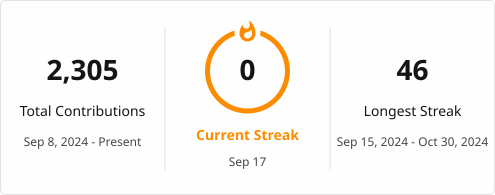

<h1 align="center">Hey, I'm Saumya — a developer who believes great web solutions begin with real-world problems.</h1>

<h3 align="center">A passionate Web & AI developer from India</h3>

  

    

Recently graduated in Computer Science & Engineering (AI), with a passion for transforming ideas into real-world web and AI solutions that simplify everyday problems. I enjoy building clean, efficient, and user-focused applications using modern web technologies and AI/GenAI tools. Skilled in React.js, JavaScript, Python, FastAPI, SQL, PostgreSQL, REST APIs, and Git, with hands-on experience working with RAG, LLMs, embeddings, and vector databases. I am currently looking for opportunities where I can contribute my skills, learn from experienced teams, and build impactful products that solve meaningful problems.
    

  

  

    
  

 

  

<h3 align="left">Connect with me:</h3>

  

  

* 📫 How to reach me **[saumyap100@gmail.com](mailto:saumyap100@gmail.com)**

<h3 align="left">Languages and Tools:</h3>

<h3 align="left">AI & GenAI:</h3>

<h3 align="left">GitHub Stats:</h3>

  

  

<h3 align="left">GitHub Contributions:</h3>

  

